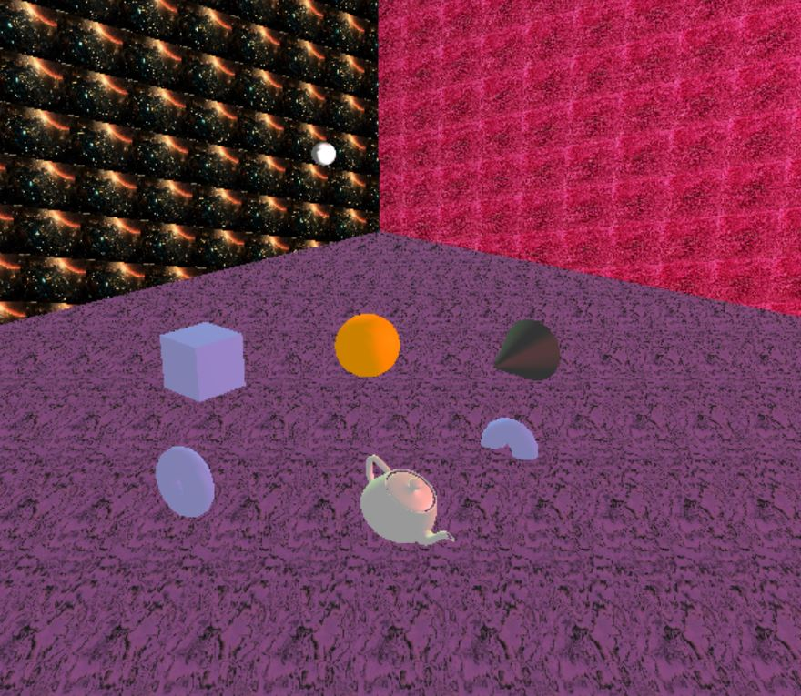

# 3D Object Modeler
## Group Members:
Kenneth Mak

Kunalpreet Matharu

## Compiling and Execution:
Type `make` while in the main project directory to compile and automatically run `main`. To manually run without compiling, type `./main.exe` or `./main`, depending on OS.

This has been tested to run on a Windows 10 OS.

### Demo

## Features and Controls:
### Controls
- **LMB**
  - Click on an object to select it. You can select all objects (including lights) except for the terrain
  - Click on anything else to deselect an object
- **RMB**
  - Right-click on a **selected** object to delete it.
  - If raycast hit nothing, deselects the select object
- **E** - Adding Objects
  - Pressing E will spawn an object with the current parameters of shape, material, and texture.
- **Changing Shapes - 1, 2, 3, 4, 5**
  - Pressing number keys will change the shape parameter
- **Applying Shapes - N**
  - Applies the selected shape to the selected object
- **Changing Material - SHIFT + '1, 2, 3, 4, 5'**
  - Pressing SHIFT and a number key will change the material parameter
- **Applying Material - M**
  - Applies the selected material to the selected object
- **Changing Textures - 6, 7, 8, 9**
  - Applies a texture to all interactable objects
  - 6 is no texture, 7-9 are textures loaded
  - The terrain (floor + 2 walls) display the three textures
- **WASDRF**
  - Interacts with the scene depending on interaction mode
  - WS = Z-axis, AD = X-axis, RF = Y-axis
- **Z | X | C | V**
  - Changes interaction mode between Translate, Rotation, Scale, Camera
- **Translate | Rotation | Scale Mode**
  - If an object is selected, applies that interaction to the obj in the appropriate direction
- **Camera Mode**
  - **WASDRF** will now move the camera. Clicking and dragging the mouse with either **LMB/RMB** will now pan the camera in the appropriate direction
  - **WASDRF** will pan the camera relative to the direction it is facing (I.e. strafing, moving forward, generic FPS movement)
- **Arrow Keys**
  - Rotates the scene around the y-axis and z-axis
- **K | L**
  - Prompts user for input to either save or load a scene to/from a .txt file, respectively.
- **Q**
  - Quits and exits the program 

Press 'P' at any time to view the commands again. 

### Features
- **Scene Object Structure + Rendering**
  - SceneObject.h strucuture; objects are placed inside of `std::list`. Different lists to differentiate between ability to interact with them (i.e. Terrain, Lights, and InteractableObjects)
  - All lists are traversed when rendered
- **Adding/Deleting Objects**
  - Pressing E will spawn an object with the current parameters
  - Right-clicking an object will delete it
    - you can only delete a selected object - this acts as a confirmation for deleting
- **Interacting with Objects**
  - Left-click an object to select it
  - Pressing Z X C will switch the mode of interaction with it
  - WASDRF will change it accordingly
- **Mouse-Ray Picking**
  - Ray is created where mouse is on screen at time of click
  - Ray is checked with all eligible objects; a map is return consisting of objects it hit, with the key being its minimum value
  - We use multiple ray-hit algorithms
    - Ray-Plane 
    - Ray-Box = uses Ray-Plane for each face, and bounding box checks
    - Ray-Sphere = used for Spherical objects and Light objects
- **Object Support**
  - 5 objects; Cube, Sphere, Cone, Torus, Teapot
  - Selected with 1-5 keys
  - New object spawned in contain shape with current shape parameter
  - You can also use `N` to apply a shape to a selected object
- **Lighting**
  - 2 Light Sources, both represented as small white-ish spheres hovering above the ground
  - Can be clicked on - can be translated, scaled and rotated, but translation is the only one that has an effect on the lighting
- **Material**
  - 5 Materials: Blue, OrangeRed, Gray, Tan, and Maroon
  - Selected with SHIFT + 1-5 keys
  - New objects spawned will contain the material associated with the with the current material parameter
  - You can also use `M` to apply a material to a selected object
- **Scene Rotation**
  - Arrow keys left and right will rotate scene around y-axis
  - Arrow keys up and down will rotate scene around z-axis
  - Rotation will not affect raycasting (i.e. will still work the same)
- **Reset Key**
  - Press Spacebar to remove all objects
- **Load/Save**
  - Press 'K' to save the scene to a file
  - Press 'L' to load a scene from a file
  - Input the name of the file in the terminal, not the program
- **Graphic Features**
  - backface culling is implemented and used for most  of the rendering
    - the only exception is with teapot, where we have to flip from ccw to cw for it
- **Texture Mapping**
  - 3 Textures, located in assets: carpet, marble, and battlecruiser
    - carpet and marble from tutorial and lecture code
    - battlecruiser using ImageMagick
  - Floor and the two walls each display one of the assets
  - Press the 6,7,8,9 keys to switch between textures
    - 6 = No Texture, 7-9 = Texture
  - All interactable objects will take the texture of the currently selected parameter
- **Camera Control**
  - Switch to Camera Mode with `V`
  - Use WASD to move around, R and F to ascend/descend
    - Camera Movement is relative to the direction of the camera, instead of the world axis
  - Use LMB/RMB click and drag to change angle of camera
### Additional Features
- **LightSource Ray Picking**
  - Objects with Type 'Sphere' and the Light Sources use Ray-Sphere collision handling instead of the Ray-Box that other objects use
  - Light sources can be selected and moved around
- **Camera Movement relative to Camera Direction**
  - Movement of WASD,RF in Camera Mode will be along the Camera's direction, instead of moving along the X-Axis and Z-Axis in the world coordinate system.
